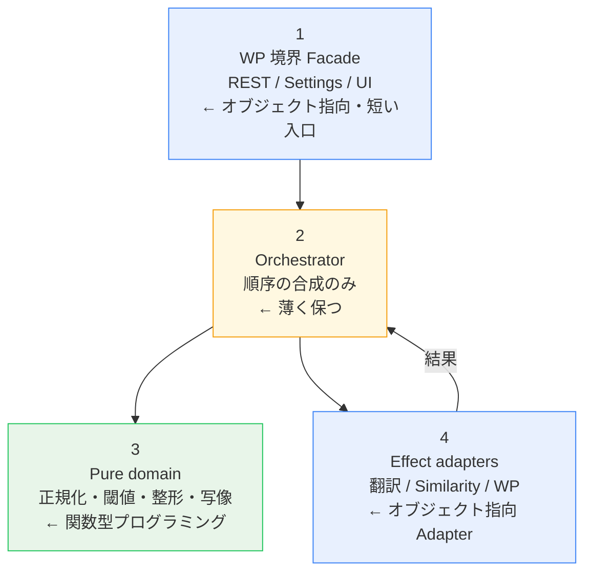

# S2J Slug Generater - FOP + Clean Coding 原則

← [索引](./specs.md)

## 目的

旧 SPEC のオブジェクト指向プログラミングパターン記述と、先行して置いた関数型プログラミング単体の語彙を、**FOP (外側はオブジェクト指向、内側は関数型プログラミング) + Clean Coding** にそろえます。実装言語は PHP / TypeScript でも、約束は同じとします。

## Clean Coding (全体の作法)

どのパラダイムのコードでも、次を守ります。

1. **意味のある命名** — ドメイン語 (`normalizeToSlug`、`passesThreshold`) を使う
2. **1関数は1つのこと** — たとえば、翻訳 HTTP と閾値判定を同じ関数に混ぜない
3. **短く保つ** — 読めないほど抽象化しない。パターンは複雑さを減らすためだけに使う
4. **コメントは「なぜ」** — 自明な「何を」は書かない。ラウンドトリップ比較の意図など、ドメイン判断を残す
5. **過剰適用しない** — ファイルを増やせば Clean になるわけではない

## FOP の役割分担

### 外枠 (オブジェクト指向 / GoF デザインパターン的)

副作用、接続、入口をカプセル化します。

| 関心 | パターン相当 | 実装の好み |
| --- | --- | --- |
| 外部 API | Adapter | クラスでも関数モジュールでも可。HTTP 詳細を外に漏らさない |
| REST / 設定の入口 | 薄い Facade | 「認可 → パース → オーケストレーション」を短く並べる |
| 依存の受け渡し | DI | コンストラクタまたは引数。サービスロケータの乱用は避ける |
| Strategy / Command | (振る舞い) | **可能なら高階関数**。クラス階層は肥大化するときだけ |

### 中身 (関数型プログラミング)

ビジネスロジックとデータを不変・純粋に保ちます。

| 関心 | やり方 |
| --- | --- |
| 設定・結果 | 不変レコード (`PluginConfig`、`GenerateSuccess`) |
| 変換 | 純関数 (同じ入力 → 同じ出力) |
| 失敗 | `Result` / `{ success, error }` 相当。境界で例外を畳んでもよい |
| 処理の骨組み | 継承の Template Method ではなく **合成** |

## Clean Architecture から借用する原則

Clean Architecture から次だけを借用します。レイヤ名の儀式は、作りません。

* 依存の向きは、外 → 内
* 内側 (ビジネスロジック) は、フレームワークを知らない
* 外側 (Adapter / Facade) は、詳細で置換可能

## 旧 SPEC (デザインパターン) → FOP 写像

| 旧 SPEC | FOP での置き方 |
| --- | --- |
| Template Method | 外側オーケストレータが順序を決める。各ステップは純関数 or 注入された Adapter |
| Abstract Factory | `TranslationProvider` / `SimilarityAiProvider` レジストリ (データ + 関数)。Factory クラス階層は置かない |
| Strategy (類似度) | 記述子の `compare` を注入。必要なら薄い Similarity Adapter |
| 手続き的 UI 手順 | イベント → (純な状態写像 or effect) → 表示更新 |
| 神クラス | 純関数群 + 薄い Facade / Orchestrator + Adapter |

## レイヤ分け (読みやすさ優先の薄い分割)

* 1へ行くほど WordPress 依存が増える
* 中の pure domain ほどユニットテストしやすい
* フォルダーはこれに機械対応させすぎない (Clean Coding: 追える配置を優先)

## 命名の約束

| 接頭辞 / 形 | 意味 |
| --- | --- |
| `toX` / `normalizeX` / `formatX` / `passesX` | 純関数 (内側) |
| `fetchX` / `loadX` / `saveX` / `applyX` | 効果を含む (外枠) |
| `withX` | 依存や設定を部分適用した関数を返す |
| `*Adapter` / `*Facade` (使うなら) | 外枠の境界。名前で I/O 担当と分かるようにする |
| `Result<T, E>` | 成功 `T` または失敗 `E` |
