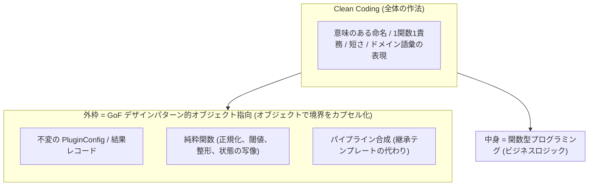

# S2J Slug Generater — 仕様 (FOP + Clean Coding)

本ドキュメントでは、WordPress プラグイン「S2J Slug Generater」の専用仕様を定義します。

共通基盤は、引き続き次に準拠します。

* [WP_PLUGIN_SPEC.md (共通仕様)](https://github.com/stein2nd/wp-plugin-spec/blob/main/WP_PLUGIN_SPEC.md)

---

## 設計・実装の基本アプローチ

本プラグインは、次を **基本アプローチ** とします。

* **FOP (Functional Object-Oriented Programming) + Clean Coding 土台**  
* Clean Architecture はフル採用せず、**借用する原則だけ** を取り入れる

### 組み合わせの理由

WordPress プラグインでは、貢献者が追いやすい **FOP 寄り** を主とし、Clean Architecture の儀式的レイヤ分けは避けます。

| 手法 | 活かす利点 | 抑えたい欠点 |
| --- | --- | --- |
| Clean Coding | 読みやすさ、命名、短い関数 | 原則の盲信による過剰分割 |
| GoF デザインパターン | 外枠の再利用、意思疎通 | クラス爆発、過剰設計 |
| 関数型プログラミング | 不変データ、純粋な計算の予測しやすさ | 学習コスト、I/O / 状態の扱いにくさ |

### 役割分担 (実装時の約束)

1. Clean Coding を全体の基礎に敷く
   * GoF デザインパターン / 関数型プログラミングのどちらを使う箇所でも、読みやすさを最優先する。
   * 抽象やパターンは「読む人のコスト」を下げない範囲でのみ使う。
2. システムの外枠を GoF デザインパターン (オブジェクト指向) に担当させる
   * 依存の接続、外部 API、WP hooks / REST / DOM / Gutenberg store など **副作用と境界** をオブジェクト (または明確なアダプタモジュール) で包む。
   * 振る舞いに関するパターン (Strategy / Command 等) は、**クラス階層ではなく、高階関数・クロージャ** で足りるなら後者を選ぶ (GoF デザインパターンの堅牢性 + 関数型プログラミングの簡素さ)。
3. データの中身を関数型プログラミングに担当させる
   * スラッグ正規化、類似度のパーセント変換、閾値判定、UI 状態の更新写像など **ビジネスロジック** は、純粋関数と不変データに閉じる。



### Clean Architecture から借用する原則

フルセットの Clean Architecture (Entity / UseCase / Gateway / Presenter の定型分割) は採用しません。Clean Architecture から、次だけを借用します。

| 借用する原則 | 本プラグインでの意味 |
| --- | --- |
| 依存の向きは外 → 内 | ドメイン純関数は、WordPress / HTTP を知らない |
| 内側はビジネスルール | 正規化、閾値、パイプライン組立は、フレームワーク非依存 |
| 外側は詳細 | REST、設定画面、外部 API クライアントは、置換可能な境界 |

「内側を不変・外側をオブジェクト指向」という現代的解釈の精神は、FOP と一致します。フォルダー劇場や層の儀式は作りません。

### 旧 SPEC (デザインパターン) からの扱い

| 旧 SPEC | 本アプローチ |
| --- | --- |
| Template Method | オーケストレータによる関数合成 (外側) + 純ステップ (内側) |
| Abstract Factory | プロバイダ **データ + 関数** のレジストリ (翻訳: `translate`、類似度 AI: `compare`)。Factory クラス階層は置かない |
| Strategy (類似度) | 注入可能な関数 / 薄い Adapter (クラス必須としない) |

詳細は [02-fp-principles.md](./02-fp-principles.md) を参照してください。

## ドキュメント索引

| 文書 | 内容 |
| --- | --- |
| [01-overview.md](./01-overview.md) | プラグイン概要、メタ情報 |
| [02-fp-principles.md](./02-fp-principles.md) | FOP + Clean Coding の詳細・写像 |
| [03-domain-model.md](./03-domain-model.md) | 不変データ (型・設定・結果) |
| [04-pipeline.md](./04-pipeline.md) | 候補生成 / スラッグ化パイプライン |
| [05-providers.md](./05-providers.md) | 翻訳プロバイダ (外枠 Adapter + データ) |
| [06-similarity.md](./06-similarity.md) | 類似度 AI プロバイダ (外枠 Adapter + データ) + 純関数 |
| [07-admin.md](./07-admin.md) | 管理画面 (設定の境界) |
| [08-editor.md](./08-editor.md) | 投稿の編集画面 (Gutenberg / Classic) |
| [09-rest.md](./09-rest.md) | REST API (薄い Facade) |
| [10-build-and-i18n.md](./10-build-and-i18n.md) | ビルド・国際化・構成 |
| [migration-from-legacy.md](./migration-from-legacy.md) | 旧 SPEC / SPEC_mod からの対応表 |

## 読み方 (推奨順)

索引のファイルを、次の順で読むことを勧めます。

1. **本ページ (`specs.md`)** の「設計・実装の基本アプローチ」→ 設計の約束
2. [01-overview.md](./01-overview.md) → 何をするプラグインか
3. [02-fp-principles.md](./02-fp-principles.md) → どこをオブジェクト指向 / どこを関数型プログラミングにするか
4. [03-domain-model.md](./03-domain-model.md) → 不変データ (型・設定・結果)
5. [04-pipeline.md](./04-pipeline.md) → 候補生成 / スラッグ化の計算規則
6. [05-providers.md](./05-providers.md) → 翻訳プロバイダ (差し替え可能な外枠)
7. [06-similarity.md](./06-similarity.md) → 類似度 AI プロバイダ (差し替え可能な外枠) + 純関数
8. [07-admin.md](./07-admin.md) → 管理画面 (設定の境界)
9. [08-editor.md](./08-editor.md) → 投稿の編集画面 (Gutenberg / Classic)
10. [09-rest.md](./09-rest.md) → REST API (薄い Facade)
11. [10-build-and-i18n.md](./10-build-and-i18n.md) → ビルド・国際化・構成
12. [migration-from-legacy.md](./migration-from-legacy.md) → 旧 SPEC / SPEC_mod からの対応表

## 一言でいうコア

パイプラインの詳細は、[04-pipeline.md](./04-pipeline.md) を参照してください。

* UI 配置: Gutenberg は `PluginDocumentSettingPanel`、Classic は `edit_form_after_title`

```text
Title
  → translate(title, source → en)      // 外枠 effect: Translation Adapter
  → reverseTranslate(en, en → source)  // 外枠 effect: Translation Adapter
  → similarity(title, reversed)         // 外枠 effect: Similarity Adapter
  → filterByThreshold(score, threshold) // 内側 pure → accepted
  → (candidate text + similarity % + accepted)

CandidateText (accepted 時のみ)
  → normalizeToSlug(text)               // 内側 pure
  → applyToPostSlug(slug)               // 外枠 effect: Editor Adapter
```

## 旧仕様からの変遷

本仕様は、旧仕様 (`docs/archive/SPEC.md`、`docs/archive/SPEC_mod.md`) を再設計したものです。

機能要件の正は、**`SPEC_mod.md` 相当** (S2J Similarity Service / コサイン類似度) です。

`SPEC.md` (レーベンシュタイン) との差分は、[migration-from-legacy.md](./migration-from-legacy.md) を参照してください。
